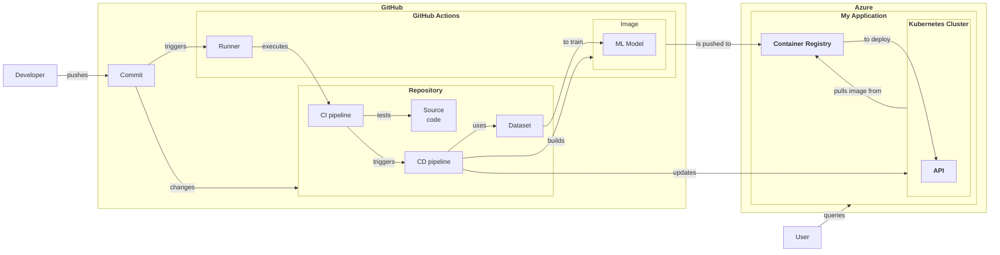

## Recipe 08
Below is an example of using Mermaid to create a Data Flow Diagram (DFD).  
```
flowchart LR
    Developer["Developer"] -- "pushes" --> Commit["Commit"] -- "changes"--> Repository
    subgraph GitHub["<b>GitHub</b>"]
        subgraph Repository["<b>Repository</b>"]
            SourceCode["Source\ncode"]
            Dataset["Dataset"]
            CIPipeline["CI pipeline"]
            CDPipeline["CD pipeline"]
        end
        subgraph GitHubActions["<b>GitHub Actions</b>"]
            Runner["Runner"]
            subgraph Image["Image"]
                Model["ML Model"]
            end
        end
        Commit -- "triggers" --> Runner 
        Runner -- "executes" --> CIPipeline
        CIPipeline -- "tests" --> SourceCode
        CIPipeline -- "triggers" --> CDPipeline
        CDPipeline -- "uses" --> Dataset -- "to train" --> Model
        CDPipeline -- "builds" --> Image
    end

    subgraph Azure["<b>Azure</b>"]
        subgraph MyApplication["<b>My Application</b>"]
            ContainerRegistry["<b>Container Registry</b>"]
            Image -- "is pushed to" --> ContainerRegistry
            subgraph Kubernetes["<b>Kubernetes Cluster</b>"]
                API["<b>API</b>"]
            end
            CDPipeline -- "updates" --> Kubernetes
            Kubernetes -- "pulls image from" --> ContainerRegistry -- "to deploy" --> API
        end
    end
    User["User"] -- "queries" --> MyApplication
```

Below is the rendered version of the DFD. 

