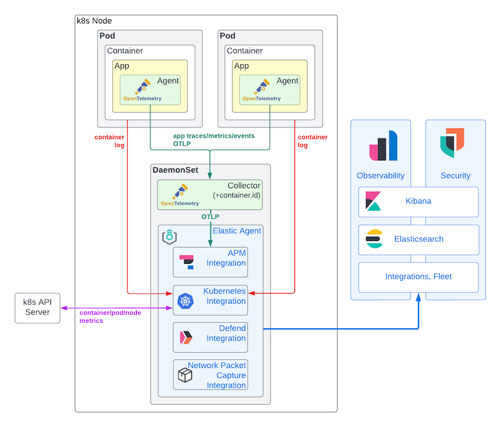
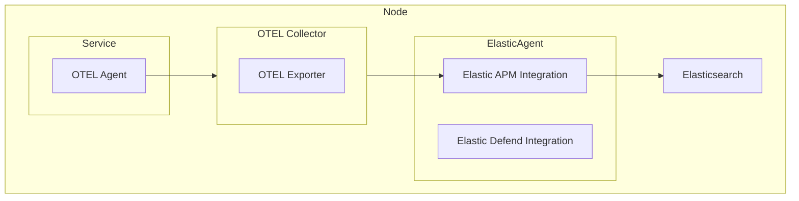

## Recipe 10: Add observability and security to an Azure Kubernetes Service (AKS) instance using OpenTelemetry and Elastic.
The purpose of this recipe is to add observability and security to an AKS instance using OpenTelemetry and Elastic. 
* [References](#references)
* [Notes](#notes)
* [Setup](#setup)



## References
If I find any helpful references, I will put them here. 
* [OpenTelemetry: Collector | Configuration](https://opentelemetry.io/docs/collector/configuration/)
* [Elastic: Modern observability and security on Kubernetes with Elastic and OpenTelemetry](https://www.elastic.co/blog/implementing-kubernetes-observability-security-opentelemetry)
* [Elastic: Add a Fleet Server](https://www.elastic.co/guide/en/fleet/8.5/add-fleet-server-on-prem.html)
* [Elastic: Run Elastic Agent Standalone on Kubernetes](https://www.elastic.co/guide/en/fleet/current/running-on-kubernetes-standalone.html)
* [Elastic APM Server Helm Chart: values.yaml example](https://github.com/elastic/helm-charts/blob/main/apm-server/examples/security/values.yaml)
* [OpenTelemetry TLS Configuration Settings](https://github.com/open-telemetry/opentelemetry-collector/blob/main/config/configtls/README.md)
* [Azure: Configure a federated identity credential on an app](https://learn.microsoft.com/en-us/entra/workload-id/workload-identity-federation-create-trust?pivots=identity-wif-apps-methods-azp#github-actions)
* [Azure: Configure a GitHub Action to create a container instance](https://learn.microsoft.com/en-us/azure/container-instances/container-instances-github-action?tabs=openid)
* [Elastic Integration](https://docs.elastic.co/integrations)
* [Switch to the Elastic APM integration](https://www.elastic.co/guide/en/observability/current/apm-upgrade-to-apm-integration.html)
* [Fleet-Managed APM Server](https://www.elastic.co/guide/en/observability/8.13/_fleet_managed_apm_server.html)

## Notes
If there are any additional notes, I will put them here.

**Elastic Integrations**   
In order to add Integrations to Elastic Agent, reference the URLs here: [https://docs.elastic.co/integrations/](https://docs.elastic.co/integrations/). For example, the name of the Package Name for APM is `apm` because the URL for the integration looks like this `https://docs.elastic.co/integrations/apm`. Meanwhile, the Package Name for Fleet Server is `fleet_server` because the URL for this integration is `https://docs.elastic.co/integrations/fleet_server`. 
```yaml
  config:
    xpack.fleet.agents.elasticsearch.hosts: ["https://elasticsearch-es-http.default.svc:9200"]
    xpack.fleet.agents.fleet_server.hosts: ["https://fleet-server-agent-http.default.svc:8220"]
    xpack.fleet.packages:
    - name: system
      version: latest
    - name: elastic_agent
      version: latest
    - name: fleet_server
      version: latest
    - name: kubernetes
      version: latest
    - name: apm
      version: latest
    - name: endpoint
      version: latest
    xpack.fleet.agentPolicies:
    - name: Fleet Server Policy
      id: fleet-server
      namespace: default
      monitoring_enabled:
      - logs
      - metrics
      unenroll_timeout: 900
      package_policies:
      - name: fleet_server-1
        id: fleet_server-1
        package:
          name: fleet_server
    - name: Elastic Agent Policy
      id: elastic-agent
      namespace: default
      monitoring_enabled:
      - logs
      - metrics
      unenroll_timeout: 900
      package_policies:
      - name: system-1
        package:
          name: system
      - name: kubernetes-1 
        package:
          name: kubernetes
      - name: apm-1 
        package:
          name: apm
```

## Setup
This recipe assumes (1) you're using a Linux-based environment (GitHub Codespaces, Azure Shell, Windows Subsystem for Linux, etc.), (2) you've installed the software required for this recipe (i.e., Python, Docker, Kubernetes, Helm, and Azure CLI), (3) you've forked this repository, (4) you've downloaded this repository, and (5) you're running commands from the `recipe-10/` folder. 

**Step 1.** Define environment variables for your infrastructure. I usually save my environment variables in a file called something like `.env` and run `source .env` as needed. This makes it easy to pick up where I left off after leaving my workspace for an extended period of time. If you didn't know, the `source` command reads and executes shell commands from the file you provide it.   
```bash
export APP_NAME="squidfall"
export SUBSCRIPTION_ID="c60c349f-4b5c-4e39-98cb-4fc2323804c5"
export LOCATION="eastus"
export RESOURCE_GROUP_NAME="${APP_NAME}"
```
 
**Step 2.** Login to Azure using the CLI. 
```bash
az login --use-device-code
```

**Step 3.** Set your subscription.
```bash
az account set --subscription "${SUBSCRIPTION_ID}"
```

**Step 4.** Create a virtual environment to house the `scripts/init_azure.py` script's Python dependencies. 
```bash
python -m venv .venv
```

**Step 5.** Activate the `scripts/init_azure.py` script's Python virtual environment. 
```bash
source .venv/bin/activate
```

**Step 6.** Install the `scripts/init_azure.py` script's Python dependencies.
```bash
python -m pip install -r scripts/requirements.txt
```

**Step 7.** Run the `scripts/init_azure.py` script. 
```bash
python scripts/init_azure.py --app-name "${APP_NAME}" --subscription-id "${SUBSCRIPTION_ID}" --location "${LOCATION}"
```

You should get output similar to below.
```
[*] Created Terraform state resource group
[*] Created Terraform state storage account
[*] Created Terraform state blob container
[!] Copy and paste the commands below into your shell environment:

terraform -chdir=terraform init -backend-config="storage_account_name=squidfallc60c349f4b5c666" -backend-config="access_key=hhJpx3xDkS8ciDBbwvn9150vLU5UO3FMVzTS0PQzKMar8SOz/0iQuKcdvuX1TNw+2WsCmtc2yhPV+AStIPW666=="
terraform -chdir=terraform apply
```

**Step 8.** Copy and paste the commands printed by the previous step (enter `yes` when prompted). You should get output similar to below. It creates the following resources: resource group, container registry, Kubernetes cluster, and role assignment. 
```
Apply complete! Resources: 4 added, 0 changed, 0 destroyed.

Outputs:

ACR_NAME = "squidfall"
AKS_NAME = "squidfall"
```

**Step 9.** Copy and paste the commands below to your terminal session to declare and initialize the remaining environment variables needed.
```bash
export ACR_NAME=$(terraform -chdir=terraform output -raw ACR_NAME)
export AKS_NAME=$(terraform -chdir=terraform output -raw AKS_NAME)
```

**Step 10.** Download credentials from your AKS instance for `kubectl` to use. 
```bash
az aks get-credentials --resource-group "${RESOURCE_GROUP_NAME}" --name "${AKS_NAME}"
```

## Task 01: Deploy the Elastic Stack
**Step 1.** Install Elastic's Custom Resource Definitions (CRDs).
```bash
kubectl create -f https://download.elastic.co/downloads/eck/2.12.1/crds.yaml
```

You should get output similar to below.
```
customresourcedefinition.apiextensions.k8s.io/agents.agent.k8s.elastic.co created
customresourcedefinition.apiextensions.k8s.io/apmservers.apm.k8s.elastic.co created
customresourcedefinition.apiextensions.k8s.io/beats.beat.k8s.elastic.co created
customresourcedefinition.apiextensions.k8s.io/elasticmapsservers.maps.k8s.elastic.co created
customresourcedefinition.apiextensions.k8s.io/elasticsearchautoscalers.autoscaling.k8s.elastic.co created
customresourcedefinition.apiextensions.k8s.io/elasticsearches.elasticsearch.k8s.elastic.co created
customresourcedefinition.apiextensions.k8s.io/enterprisesearches.enterprisesearch.k8s.elastic.co created
customresourcedefinition.apiextensions.k8s.io/kibanas.kibana.k8s.elastic.co created
customresourcedefinition.apiextensions.k8s.io/logstashes.logstash.k8s.elastic.co created
customresourcedefinition.apiextensions.k8s.io/stackconfigpolicies.stackconfigpolicy.k8s.elastic.co created
```

**Step 2.** Install the Elastic Operator.
```bash
kubectl apply -f https://download.elastic.co/downloads/eck/2.12.1/operator.yaml
```

You should get output similar to below.
```
namespace/elastic-system created
serviceaccount/elastic-operator created
secret/elastic-webhook-server-cert created
configmap/elastic-operator created
clusterrole.rbac.authorization.k8s.io/elastic-operator created
clusterrole.rbac.authorization.k8s.io/elastic-operator-view created
clusterrole.rbac.authorization.k8s.io/elastic-operator-edit created
clusterrolebinding.rbac.authorization.k8s.io/elastic-operator created
service/elastic-webhook-server created
statefulset.apps/elastic-operator created
validatingwebhookconfiguration.admissionregistration.k8s.io/elastic-webhook.k8s.elastic.co created
```

**Step 3.** Apply the provided Kubernetes manifest. 
```bash
kubectl apply -f kubernetes/elastic.yaml
```

**Step 4.** Expose the Kibana service by deploying a Load Balancer service to route traffic to it. The command sentence below creates a Load Balancer service called `siem`. SIEM is an acronym for Security Incident and Event Manager. 
```bash
kubectl expose svc kibana-kb-http --type=LoadBalancer --name siem
```

**Step 5.** Get the external IP address of the `siem` service. 
```bash
kubectl get svc/siem
```

You should get output similar to below. 
```
NAME   TYPE           CLUSTER-IP   EXTERNAL-IP      PORT(S)          AGE
siem   LoadBalancer   10.0.19.99   48.216.128.246   5601:32236/TCP   11s
```

**Step 6.** Get the password for the `elastic` account. 
```bash
kubectl get secrets elasticsearch-es-elastic-user -ojsonpath="{.data.elastic}" | base64 -d && echo ""
```

**Step 7.** Open a browser and go to TCP port 5601 on the external IP address of the `siem` service (e.g., `https://48.216.128.246`). Then, login. For the username field, enter `elastic`. For the password field, use the one you printed to the console in the previous step.

**Step 8.** Text goes here.


## Task 02: Deploy OpenTelemetry
**Step 1.** Add Custom Resource Definitions (CRDs) to your cluster for the following object types: Certificate and Issuer. The OpenTelemetry Operator needs them both. 
```bash
kubectl apply -f https://github.com/cert-manager/cert-manager/releases/download/v1.14.4/cert-manager.yaml
```

**Step 2.** Wait for the CRDs to take affect, then deploy an OpenTelemetry Operator to the `opentelemetry-operator-system` namespace in your cluster.
```bash
kubectl apply -f https://github.com/open-telemetry/opentelemetry-operator/releases/latest/download/opentelemetry-operator.yaml
```

**Step 3.** Confirm your OpenTelemetry Operator is running by checking the status of the pods created in the previous step. 
```bash
kubectl get pods -n opentelemetry-operator-system
```

**Step 4.** Apply the Kubernetes manifest file called `otel-collector.yaml`. It creates a OpenTelemetry Collector and OpenTelemetry Instrumentation deployment.  
```bash
kubectl apply -f kubernetes/otel-collector.yaml
```

**Step 5.** Confirm your OpenTelemetry Collector deployment is running by checking the status of the pods created in the previous step. You should probably also check the logs of each pod too. 
```bash
kubectl get pods 
```

**Step 6.** Confirm your OpenTelemetry Instrumentation workload is working by checking the status of the pods created in the previous step. *This step is also important for checking and/or checking the endpoint of your OTEL collector*.
```bash
kubectl get instrumentation
```

## Task 03: Deploy Your App
**Step 1.** Login to your ACR. 
```bash
az acr login --name "${ACR_NAME}"
```

**Step 2.** Build, tag, and push a container image to your ACR. Specifying `--platform linux/amd64` forces your local Docker host to build an image using the same CPU architecture as the Docker hosts that will be used in Azure. Also, the command sentence below references a Dockerfile and FastAPI-application in the folder of this recipe, feel free to use whatever image you want. Just make sure it's been instrumented to use OpenTelemetry.
```bash
docker build --push --tag ${ACR_NAME}.azurecr.io/${APP_NAME}:v1.0.0 --platform linux/amd64 -f docker/Dockerfile src/
```

**Step 3.** Deploy your app using [the provided Kubernetes manifest file](kubernetes/service.yaml). It creates two deployments (staging and production) and one Load Balancer service. Both deployments have an annotation the OpenTelemetry Collector uses to decide whether or not to inject telemetry functions. 
```bash
kubectl apply -f kubernetes/service.yaml
```

**Step 4.** If you make changes to your app and need to execute a "Blue-Green deployment strategy," use the command below. It specifically configures the load balancer for the service in question to route traffic to the `production` deployment (i.e., the *green* environment).  
```bash
kubectl set selector svc/${APP_NAME} app=${APP_NAME},env=production
```

### Validation
In order to confirm I was getting logs, I did the step below. 

**Step 1.** Submitted a HTTP request to my app. 
```bash
curl http://4.246.250.101/
```

**Step 2.** Checked my's app pod logs. 
```bash
kubectl logs pods/squidfall-staging-778d964f9b-lhr4p
```

Below is an example of what it logged.
```
Defaulted container "squidfall" out of: squidfall, opentelemetry-auto-instrumentation-python (init)
Attempting to instrument FastAPI app while already instrumented
INFO:     Started server process [1]
INFO:     Waiting for application startup.
INFO:     Application startup complete.
INFO:     Uvicorn running on http://0.0.0.0:8080 (Press CTRL+C to quit)
INFO:     10.244.2.1:52944 - "GET /healthcheck HTTP/1.1" 200 OK
INFO:     10.224.0.7:8999 - "GET / HTTP/1.1" 200 OK
INFO:     10.224.0.7:8999 - "GET /favicon.ico HTTP/1.1" 404 Not Found
```

**Step 3.** Checked the OpenTelemetry Collector pod's logs.
```bash
kubectl logs pods/otel-collector-5fd7b4b889-czrfk 
```

Below is an example of what it logged.
```
ScopeSpans #0
ScopeSpans SchemaURL: 
InstrumentationScope opentelemetry.instrumentation.asgi 0.44b0
Span #0
    Trace ID       : f32b80d48bce3438e150a0d54effc6b6
    Parent ID      : 4487416eedd61a1d
    ID             : b4d3f11a8dcb0272
    Name           : GET / http send
    Kind           : Internal
    Start time     : 2024-04-28 16:19:31.429795502 +0000 UTC
    End time       : 2024-04-28 16:19:31.430269008 +0000 UTC
    Status code    : Unset
    Status message : 
Attributes:
     -> http.status_code: Int(200)
     -> type: Str(http.response.start)
Span #1
    Trace ID       : f32b80d48bce3438e150a0d54effc6b6
    Parent ID      : 4487416eedd61a1d
    ID             : 6b3d2fa7a6929123
    Name           : GET / http send
    Kind           : Internal
    Start time     : 2024-04-28 16:19:31.430360009 +0000 UTC
    End time       : 2024-04-28 16:19:31.430523011 +0000 UTC
    Status code    : Unset
    Status message : 
Attributes:
     -> type: Str(http.response.body)
Span #2
    Trace ID       : f32b80d48bce3438e150a0d54effc6b6
    Parent ID      : 
    ID             : 4487416eedd61a1d
    Name           : GET /
    Kind           : Server
    Start time     : 2024-04-28 16:19:31.428490688 +0000 UTC
    End time       : 2024-04-28 16:19:31.430538511 +0000 UTC
    Status code    : Unset
    Status message : 
Attributes:
     -> http.scheme: Str(http)
     -> http.host: Str(10.244.2.8:8080)
     -> net.host.port: Int(8080)
     -> http.flavor: Str(1.1)
     -> http.target: Str(/)
     -> http.url: Str(http://10.244.2.8:8080/)
     -> http.method: Str(GET)
     -> http.server_name: Str(4.246.250.101)
     -> http.user_agent: Str(Mozilla/5.0 (Macintosh; Intel Mac OS X 10_15_7) AppleWebKit/537.36 (KHTML, like Gecko) Chrome/124.0.0.0 Safari/537.36)
     -> net.peer.ip: Str(10.224.0.7)
     -> net.peer.port: Int(65024)
     -> http.route: Str(/)
     -> api.response: Str(hi non sunt droids quam quaeritis)
     -> http.status_code: Int(200)
        {"kind": "exporter", "data_type": "traces", "name": "debug"}
```

**Step 4.** Checked the APM Server pod's logs.
```bash
kubectl logs pods/apm-server-apm-server-5b7db699bc-ccfbx
```

Below is an example of what it logged.
```json
{"log.level":"info","@timestamp":"2024-04-28T16:22:13.182Z","log.logger":"request","log.origin":{"file.name":"middleware/log_middleware.go","file.line":61},"message":"request ok","service.name":"apm-server","url.original":"/","http.request.method":"GET","user_agent.original":"kube-probe/1.28","source.address":"10.244.2.1","http.request.body.bytes":0,"http.request.id":"2f605867-f372-41d1-9014-f4357aa535d2","event.duration":48201,"http.response.status_code":200,"ecs.version":"1.6.0"}
{"log.level":"info","@timestamp":"2024-04-28T16:22:20.093Z","log.logger":"beater.grpc","log.origin":{"file.name":"interceptors/logging.go","file.line":65},"message":"request accepted","service.name":"apm-server","source.address":"10.244.2.7:38170","grpc.request.method":"/opentelemetry.proto.collector.trace.v1.TraceService/Export","event.duration":403705,"grpc.response.status_code":"OK","ecs.version":"1.6.0"}
{"log.level":"info","@timestamp":"2024-04-28T16:22:23.181Z","log.logger":"request","log.origin":{"file.name":"middleware/log_middleware.go","file.line":61},"message":"request ok","service.name":"apm-server","url.original":"/","http.request.method":"GET","user_agent.original":"kube-probe/1.28","source.address":"10.244.2.1","http.request.body.bytes":0,"http.request.id":"5af441f1-7989-4f33-8350-9a565f1d83c4","event.duration":97701,"http.response.status_code":200,"ecs.version":"1.6.0"}
{"log.level":"info","@timestamp":"2024-04-28T16:22:23.182Z","log.logger":"request","log.origin":{"file.name":"middleware/log_middleware.go","file.line":61},"message":"request ok","service.name":"apm-server","url.original":"/","http.request.method":"GET","user_agent.original":"kube-probe/1.28","source.address":"10.244.2.1","http.request.body.bytes":0,"http.request.id":"46d17fc7-d341-4ff6-bfa4-9bba3fe0256a","event.duration":73701,"http.response.status_code":200,"ecs.version":"1.6.0"}
{"log.level":"info","@timestamp":"2024-04-28T16:22:30.184Z","log.logger":"beater.grpc","log.origin":{"file.name":"interceptors/logging.go","file.line":65},"message":"request accepted","service.name":"apm-server","source.address":"10.244.2.7:38166","grpc.request.method":"/opentelemetry.proto.collector.metrics.v1.MetricsService/Export","event.duration":2476636,"grpc.response.status_code":"OK","ecs.version":"1.6.0"}
{"log.level":"info","@timestamp":"2024-04-28T16:22:33.182Z","log.logger":"request","log.origin":{"file.name":"middleware/log_middleware.go","file.line":61},"message":"request ok","service.name":"apm-server","url.original":"/","http.request.method":"GET","user_agent.original":"kube-probe/1.28","source.address":"10.244.2.1","http.request.body.bytes":0,"http.request.id":"9c7adb21-f5a2-4c71-9b48-b5aaf2304625","event.duration":95501,"http.response.status_code":200,"ecs.version":"1.6.0"}
{"log.level":"info","@timestamp":"2024-04-28T16:22:33.182Z","log.logger":"request","log.origin":{"file.name":"middleware/log_middleware.go","file.line":61},"message":"request ok","service.name":"apm-server","url.original":"/","http.request.method":"GET","user_agent.original":"kube-probe/1.28","source.address":"10.244.2.1","http.request.body.bytes":0,"http.request.id":"aacac5cb-6a2c-407f-a9a6-d00785904048","event.duration":78601,"http.response.status_code":200,"ecs.version":"1.6.0"}
```

**Step 4.** Checked the "Observability | APM | Services" page in Kibana. 

**Step 5.** Checked the "APM" data view on the "Analytics | Discover" page in Kibana. 